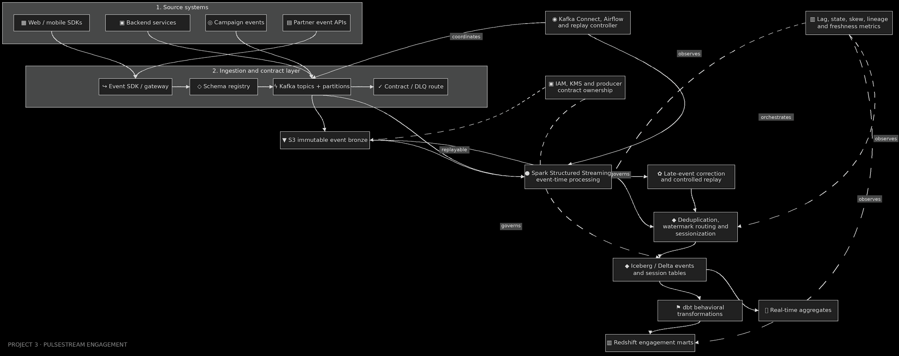

# PulseStream Real-Time Engagement Platform

[](https://github.com/bhuvaneshwaranmurugan21/pulsestream-realtime-engagement-platform/actions/workflows/quality.yml)
[](https://github.com/bhuvaneshwaranmurugan21/pulsestream-realtime-engagement-platform/actions/workflows/spark.yml)
[](https://github.com/bhuvaneshwaranmurugan21/pulsestream-realtime-engagement-platform/actions/workflows/infrastructure.yml)
[](https://github.com/bhuvaneshwaranmurugan21/pulsestream-realtime-engagement-platform/actions/workflows/analytics.yml)
[](https://github.com/bhuvaneshwaranmurugan21/pulsestream-realtime-engagement-platform/actions/workflows/security.yml)


I built PulseStream to make event-time engagement analytics correct when producer events are
duplicated, delayed, malformed or replayed. Its core release unit is not one table: it is a
manifest-bound generation containing four compatible Iceberg snapshots and an exact Kafka offset
frontier. A DynamoDB compare-and-swap transaction makes that bundle visible atomically.



## What is implemented

- A 50-source, owner-tagged contract registry with strict field and enum validation.
- HMAC user tokenization at the trust boundary and recursive prohibited-field rejection.
- Kafka ingestion into immutable Iceberg bronze plus a redacted contract-quarantine route.
- Deterministic identity gating for exact duplicates and same-ID/different-payload conflicts.
- Cross-generation watermark semantics, explicit late-event exceptions and controlled replay.
- Event-time sessionization and engagement aggregates driven by one versioned rule document.
- Four-table Iceberg candidate branches and manifest-bound publication with stale-parent rejection.
- Airflow/EMR Serverless orchestration, Lambda controllers and AWS infrastructure as code.
- dbt engagement marts, CloudWatch alarms, security checks and executable failure evidence.

## Correctness contract

```text
raw arrivals = accepted live + accepted late + exact duplicates + quarantined
active generation = one manifest + one offset frontier + four exact table snapshots
late data is excluded from LIVE, recorded as OPEN, then included and RESOLVED by REPLAY
only candidate(parent = active) may advance the active pointer
```

The source manifest fixes the exact topic, partition ranges and parent source snapshots. The
publication manifest additionally binds the source registry, event contract, session rules and
implementation SHA-256. Re-running the same offsets cannot create a second business effect.

## Evidence, not claims

The committed [local evidence](evidence/verified-local/summary.json) is generated by executable
code. It injects a crash after 777 durable offsets, resumes processing, repeats the full input,
runs LIVE and REPLAY generations, attempts a stale publication and verifies all 23 invariants.

| Classification | Result |
|---|---|
| Measured local result | 5,006 arrivals conserved; 5,000 live, 1 late, 1 duplicate, 4 quarantined |
| Measured local result | 23/23 restart, replay, manifest and publication checks passed |
| Modeled production target | 50+ logical sources, 10M+ events/day, sub-five-minute freshness |
| Explicitly not claimed | AWS deployment, production throughput, latency or availability SLO |

The target row is a capacity/design point, not a benchmark. See
[Performance and scale](docs/PERFORMANCE.md) for the assumptions and validation plan.

## Run the reference path

```bash
python -m venv .venv
. .venv/bin/activate
pip install -e '.[dev]'
make verify
make refresh-evidence
```

Spark semantics require Java 17:

```bash
pip install -e '.[dev,spark]'
pytest -m spark --no-cov
```

To prepare and validate the AWS deployment:

```bash
python scripts/build_lambda_package.py
cp infrastructure/terraform/terraform.tfvars.example infrastructure/terraform/terraform.tfvars
terraform -chdir=infrastructure/terraform init -backend=false
terraform -chdir=infrastructure/terraform validate
```

No AWS resources are created unless `terraform apply` is run with an approved account, VPC and
alert destination.

## Repository map

| Path | Responsibility |
|---|---|
| `contracts/`, `config/` | Producer schemas, source ownership and versioned runtime rules |
| `spark_jobs/` | Kafka ingestion, event-time transforms, candidate branch construction |
| `src/pulsestream/` | Contracts, manifests, local reference model and failure evidence |
| `lambdas/` | Candidate registration and atomic active-pointer publication |
| `orchestration/` | Airflow generation/replay control plane |
| `infrastructure/terraform/` | KMS, S3, Glue, MSK, EMR, DynamoDB, Lambda and CloudWatch |
| `dbt/` | Behavioral staging and incremental engagement marts |
| `tests/`, `evidence/` | Unit/Spark tests and reproducible local verification |

Start with [Architecture](docs/ARCHITECTURE.md), then read the
[failure and replay runbook](docs/OPERATIONS.md) and [design decisions](docs/decisions/).

## Scope

This repository is a production-oriented portfolio implementation built from synthetic data and
deployable infrastructure definitions. It contains no client code, production data, credentials or
confidential configuration.

Licensed under the [MIT License](LICENSE).
